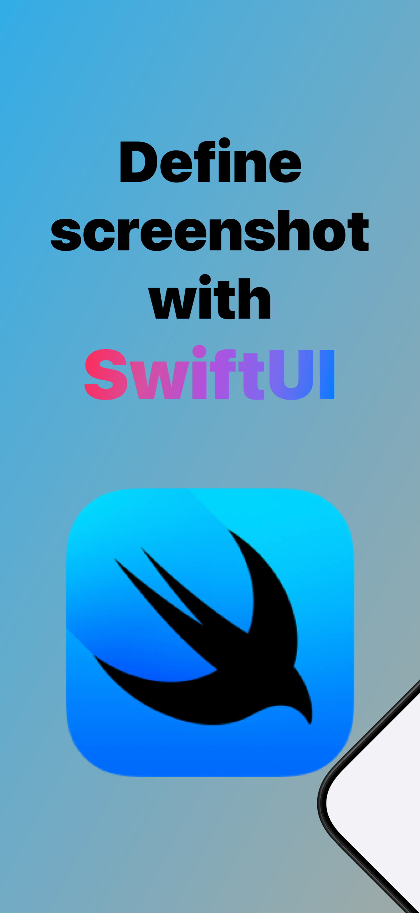
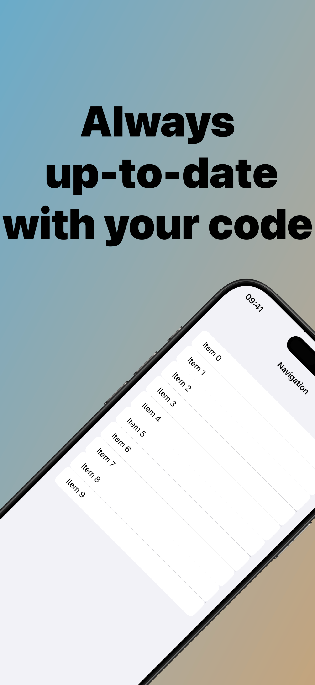
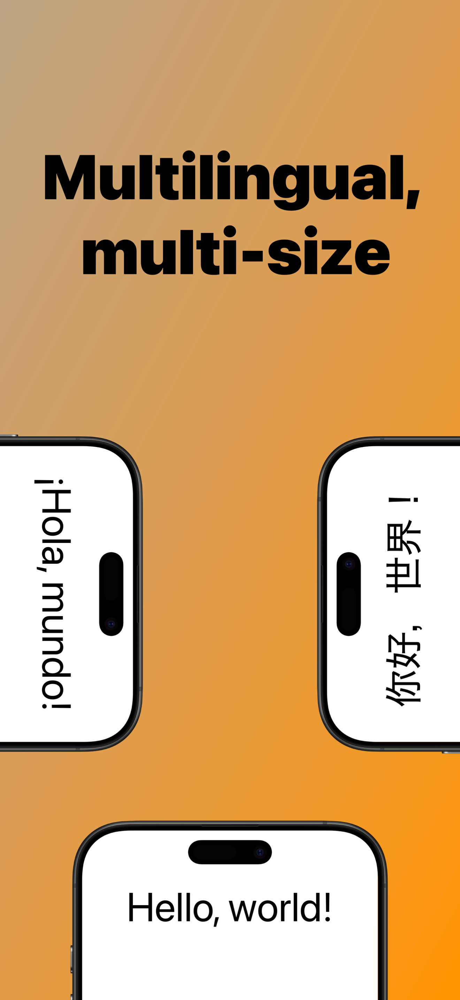
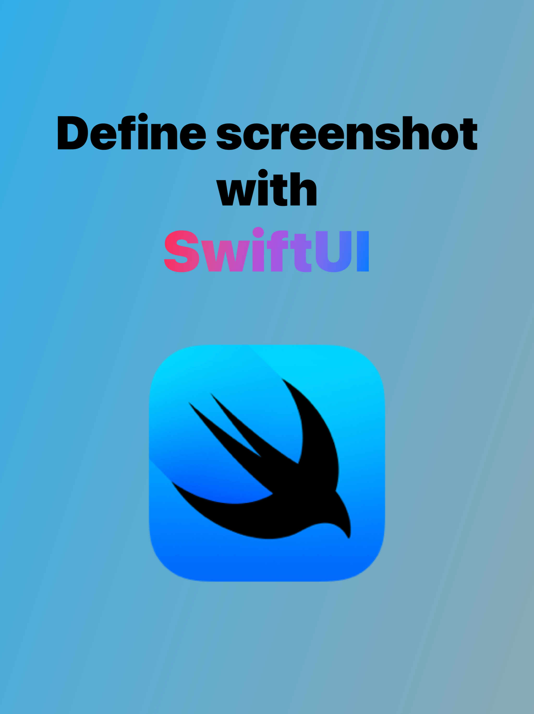
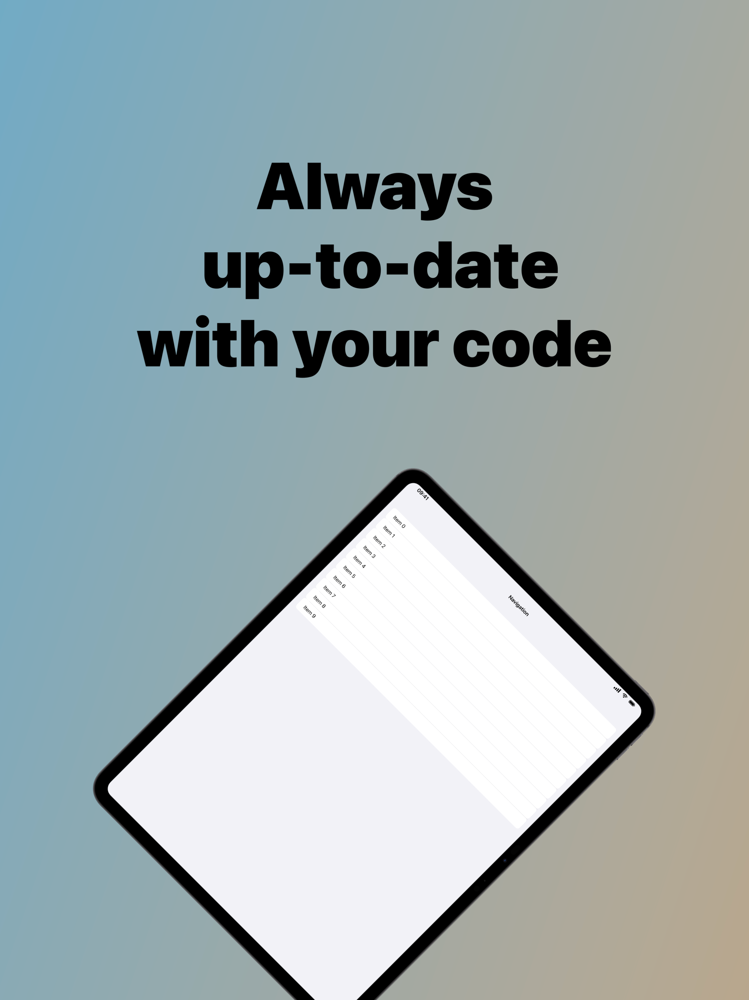
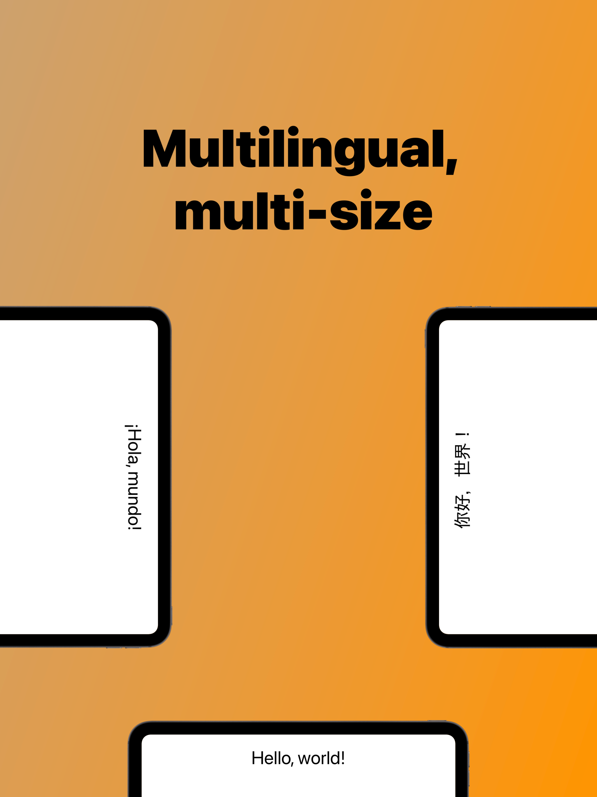

# AppScreenshotKit

AppScreenshotKit is a Swift package that automates creating App Store screenshots for iOS and iPadOS apps. It helps streamline generating high-quality, consistent screenshots across all device types and locales.

**Key Benefit**: Simply wrap your production app's views in a `DeviceView` and instantly see them rendered inside Apple's official device bezels. Your screenshots will always stay up-to-date with your app's actual UI!

<details open>
<summary><b>iPhone Screenshots</b></summary>
<div align="center">
  <p>
    
    
    
    
  </p>
</div>
</details>

<details>
<summary><b>iPad Screenshots</b></summary>
<div align="center">
  <p>
    
    
  </p>
  <p>
    
    
  </p>
</div>
</details>

> **Important**: Before using AppScreenshotKit, you need to download Apple's official device bezel images using the included CLI tool. See the [CLI Tool](#cli-tool) section for instructions.

## Features

- 📱 **Multi-device Support**: Supports all iOS/iPadOS devices including iPhone 14/15/16 series, iPad, and more
- 🖼️ **App Store Compliant**: Produces screenshots at the proper resolutions for App Store submission
- 🧩 **Flexible Customization**: Configure devices, orientations, locales, and tile counts with a simple API
- 🔄 **Batch Processing**: Generate screenshots for multiple devices, locales, and tile layouts in one call
- 💻 **Cross-platform**: Works on both macOS (CLI) and iOS (SwiftUI previews)
- 🌐 **Localization Support**: Generate screenshots for multiple locales
- 🪄 **SwiftUI Macro**: Simple and type-safe screenshot definition with the `@AppScreenshot` macro
- 🔄 **Live Updates**: Screenshots automatically update when your app's UI changes, keeping them in sync with your code

## Installation

### Swift Package Manager

Add the package as a dependency in your `Package.swift`:

```swift
.package(url: "https://github.com/shitamori1272/AppScreenshotKit.git", from: "1.0.0"),
```

## Getting Started

Here's a step-by-step guide to implement AppScreenshotKit in your own project:

1. **Install the Package**

   Add the dependency to your project using Swift Package Manager:
   ```swift
   // In Package.swift
   dependencies: [
       .package(url: "https://github.com/shitamori1272/AppScreenshotKit.git", from: "1.0.0")
   ]
   ```
   
   Or add it directly in Xcode: File → Add Packages → Search or enter package URL

2. **Create a Screenshot View**

   Create a new SwiftUI view using the `@AppScreenshot` macro:
   ```swift
   import SwiftUI
   import AppScreenshotKit
   
   @AppScreenshot(
       .iPhone69Inch(color: .blackTitanium),
       .iPad130Inch(color: .spaceGray, orientation: .landscape)
   )
   struct MyFirstScreenshot: View {
       @Environment(\.appScreenshotEnvironment) var environment
       
       var body: some View {
           VStack {
               Text("My Amazing App")
                   .font(.system(size: 100, weight: .bold))
                   .padding(.top, 100)
               
               Spacer()
               
               // Display your app content inside a device frame
               DeviceView {
                   // Your actual app view here
                   Text("App Content")
                       .frame(maxWidth: .infinity, maxHeight: .infinity)
                       .background(Color.blue.opacity(0.2))
               }
               .frame(height: environment.screenshotSize.height * 0.6)
               
               Spacer()
           }
           .frame(maxWidth: .infinity, maxHeight: .infinity)
           .background(Color(.systemGray6))
       }
   }
   ```

3. **Preview in Xcode**

   Add a preview to see your screenshot layout:
   ```swift
   #Preview {
       MyFirstScreenshot.preview()
   }
   ```

4. **Export Screenshots in Tests**

   Create a test to export screenshots:
   ```swift
   import XCTest
   import AppScreenshotKitTestTools
   
   final class ScreenshotTests: XCTestCase {
       @MainActor func testExportScreenshots() throws {
           let outputURL = URL(fileURLWithPath: "/path/to/output")
           let exporter = AppScreenshotExporter(option: .file(outputURL: outputURL))
           try exporter.export(MyFirstScreenshot.self)
       }
   }
   ```

5. **Customize as Needed**

   Experiment with different configurations:
   - Try multiple devices and orientations
   - Add locale options for internationalized screenshots
   - Create multi-tile screenshots for app walkthroughs

For more advanced usage and examples, explore the Demo project included in the repository.

## Usage

### Define Your Screenshots

Use the `@AppScreenshot` macro to easily define your screenshot configurations:

```swift
import AppScreenshotKit
import SwiftUI

@AppScreenshot(
    .iPhone69Inch(color: .blackTitanium), 
    .iPad130Inch(color: .spaceGray, orientation: .landscape),
    options: .locale([.init(identifier: "en_US"), .init(identifier: "ja_JP")])
)
struct MyAppScreenshots: View {
    @Environment(\.appScreenshotEnvironment) var environment
    
    var body: some View {
        // Your SwiftUI view content here
        DeviceView {
            Text("Hello, App Store!")
                .font(.largeTitle)
                .frame(maxWidth: .infinity, maxHeight: .infinity)
                .background(Color.white)
        }
    }
}
```

### Using Your Production App's Views

The real power of AppScreenshotKit is the ability to use your actual production views in your screenshots with minimal changes. This ensures your App Store screenshots are always in sync with your app's current design.

Here's how to showcase your real app views:

```swift
@AppScreenshot(
    .iPhone69Inch(color: .blackTitanium),
    .iPad130Inch(color: .spaceGray, orientation: .landscape)
)
struct ProductScreenshots: View {
    @Environment(\.appScreenshotEnvironment) var environment
    
    var body: some View {
        VStack(spacing: 40) {
            Text("Your App Name")
                .font(.system(size: 80, weight: .bold))
            
            // Simply wrap your production view in DeviceView
            DeviceView {
                // Your actual production view - import it directly from your app
                HomeScreenView(isLoggedIn: true)
                    .environmentObject(AppViewModel(withDemoData: true))
            }
            .statusBarShown() // Optional: Show status bar
            .frame(height: environment.screenshotSize.height * 0.7)
            
            Text("Feature Highlight Text")
                .font(.title)
        }
        .frame(maxWidth: .infinity, maxHeight: .infinity)
        .background(Color.gray.opacity(0.1))
    }
}
```

Key benefits of this approach:

1. **Always up-to-date**: When your app UI changes, your screenshots automatically update
2. **Realistic representation**: Shows exactly how your app looks on real devices
3. **Consistent branding**: Maintains your app's visual identity in App Store materials
4. **Time-saving**: No need to manually recreate or mock up your app's interface
5. **Environment-aware**: You can use environment objects to configure your views with demo data

### Generate Screenshots

To export your screenshots, you must use the `AppScreenshotExporter` class from the `AppScreenshotKitTestTools` module, which is designed to be used within your unit tests.

```swift
import AppScreenshotKit
import AppScreenshotKitTestTools
import SwiftUI
import XCTest

final class ScreenshotTests: XCTestCase {
    @MainActor func testExportScreenshots() throws {
        // Export to files
        let outputDirectoryURL = URL(fileURLWithPath: "/path/to/Screenshots")
        let exporter = AppScreenshotExporter(option: .file(outputURL: outputDirectoryURL))
        try exporter.export(MyAppScreenshots.self)
        
        // Or attach to XCTest results for easier viewing during test runs
        let testExporter = AppScreenshotExporter(option: .attachment(testCase: self))
        try testExporter.export(MyAppScreenshots.self)
    }
}
```

The `AppScreenshotExporter` automatically handles:
- Creating directory structure
- Organizing screenshots by locale, device type, and tile count
- Custom file naming with optional rules
- XCTest integration for viewing screenshots in test results

> **Note**: Screenshots should be generated as part of your unit tests. The `AppScreenshotKitTestTools` module is specifically designed for test contexts to streamline the screenshot generation workflow.

### Using Apple's Official Device Bezels

AppScreenshotKit can incorporate Apple's official device bezel images to create professional, App Store-quality screenshots. This is one of the package's most powerful features, allowing you to display your app inside beautiful, accurate device frames.

**Prerequisites**:
1. You must first download the bezel assets using the CLI tool (see [CLI Tool](#cli-tool) section)

**Export your screenshots with bezels using the `AppScreenshotExporter`**:

```swift
// In your XCTest case
let exporter = AppScreenshotExporter(option: .file(outputURL: outputDirectoryURL))
try exporter.export(MyAppScreenshots.self)
```

If you downloaded the bezel images to a custom location, you need to specify that path:

```swift
// Only needed if you used a custom output path with the CLI tool
let bezelResourcesURL = URL(fileURLWithPath: "/path/to/custom/bezels")
exporter.setAppleDesignResourceURL(bezelResourcesURL)
try exporter.export(MyAppScreenshots.self)
```

**Benefits of using official device bezels**:
- Professional appearance matching Apple's marketing materials
- Accurate representation of how your app looks on real devices
- Up-to-date device models that match what consumers use
- Better visual context for App Store screenshots
- Consistent look across all your app screenshots

### SwiftUI Previews

Preview your screenshots in Xcode without exporting files:

```swift
#Preview {
    MyAppScreenshots.preview()
}
```

### CLI Tool

AppScreenshotKit requires Apple's official device bezel images for the best results. These images are not included in the package and must be downloaded separately using the provided CLI tool.

**Important: This step is required before using device bezels in your screenshots.**

```bash
# Download bezel images
swift run AppScreenshotKitCLI download-bezel-image
```

The CLI tool will:
1. Download Apple's official design resources
2. Extract the required bezel images
3. Store them automatically in the system's cache directory
4. Set up the necessary file structure for AppScreenshotKit to use

You can optionally specify a custom output directory if needed:
```bash
swift run AppScreenshotKitCLI download-bezel-image --output /path/to/custom/location
```

You should run this command:
- When setting up AppScreenshotKit for the first time
- When you want to update the bezel images to the latest versions from Apple
- In your CI/CD pipeline to ensure bezels are available for automated screenshot generation

Once downloaded, the bezel images will be automatically detected when using the AppScreenshotExporter.

## Configuration Options

The `@AppScreenshot` macro supports several configuration options:

```swift
// Multiple locales
@AppScreenshot(
    .iPhone69Inch(), 
    options: .locale([.init(identifier: "en_US"), .init(identifier: "ja_JP")])
)

// Multiple tiles (for app walkthrough screenshots)
@AppScreenshot(
    .iPhone69Inch(), 
    options: .tiles(4)
)

// Combine multiple options
@AppScreenshot(
    .iPhone69Inch(), .iPad130Inch(),
    options: .locale([.init(identifier: "en_US"), .init(identifier: "ja_JP")]),
    options: .tiles(3)
)
```

### Adaptive Layouts with Device Category

AppScreenshotKit makes it easy to create device-specific layouts using the `environment.device.model.category` property. This allows you to automatically adapt your screenshot templates based on whether they're running on an iPhone or iPad.

Here's an example of creating responsive layouts that optimize for different device categories:

```swift
@AppScreenshot(
    .iPhone69Inch(color: .blackTitanium),
    .iPad130Inch(color: .spaceGray, orientation: .landscape)
)
struct AdaptiveScreenshot: View {
    @Environment(\.appScreenshotEnvironment) var environment
    
    var body: some View {
        ZStack {
            // Background gradient
            LinearGradient(
                colors: [.blue.opacity(0.7), .purple.opacity(0.7)],
                startPoint: .topLeading,
                endPoint: .bottomTrailing
            )
            .ignoresSafeArea()
            
            VStack(spacing: 30) {
                // Title section
                Text("My Awesome App")
                    .font(.system(size: environment.device.model.category == .iPad ? 120 : 80, weight: .bold))
                    .foregroundColor(.white)
                    .shadow(radius: 2)
                
                if environment.device.model.category == .iPad {
                    // iPad-specific layout (side-by-side)
                    HStack(spacing: 40) {
                        // Left device frame for iPad
                        DeviceView {
                            HomeView(isDemo: true)
                        }
                        .statusBarShown()
                        .frame(height: environment.screenshotSize.height * 0.65)
                        
                        // Feature highlights for iPad
                        VStack(alignment: .leading, spacing: 30) {
                            FeatureRow(icon: "star.fill", title: "Premium Features", description: "Access exclusive content")
                            FeatureRow(icon: "bolt.fill", title: "Lightning Fast", description: "Optimized performance")
                            FeatureRow(icon: "lock.fill", title: "Secure", description: "Your data is protected")
                        }
                        .padding(.trailing, 40)
                    }
                    .padding(.horizontal, 40)
                } else {
                    // iPhone-specific layout (stacked)
                    VStack {
                        // Device frame for iPhone
                        DeviceView {
                            HomeView(isDemo: true)
                        }
                        .statusBarShown()
                        .frame(height: environment.screenshotSize.height * 0.6)
                        
                        // Feature highlight for iPhone (smaller, single feature)
                        HStack {
                            Image(systemName: "star.fill")
                                .font(.system(size: 24))
                                .foregroundColor(.yellow)
                            
                            Text("Premium Experience")
                                .font(.system(size: 24, weight: .bold))
                                .foregroundColor(.white)
                        }
                        .padding()
                        .background(Color.black.opacity(0.3))
                        .cornerRadius(12)
                    }
                    .padding(.horizontal, 20)
                }
            }
        }
    }
}

// Supporting view for feature rows
struct FeatureRow: View {
    var icon: String
    var title: String
    var description: String
    
    var body: some View {
        HStack(spacing: 15) {
            Image(systemName: icon)
                .font(.system(size: 36))
                .foregroundColor(.yellow)
                .frame(width: 50)
            
            VStack(alignment: .leading) {
                Text(title)
                    .font(.system(size: 28, weight: .bold))
                    .foregroundColor(.white)
                
                Text(description)
                    .font(.system(size: 20))
                    .foregroundColor(.white.opacity(0.9))
            }
        }
        .padding()
        .background(Color.black.opacity(0.3))
        .cornerRadius(12)
    }
}
```

This example demonstrates how to:

- Use `environment.device.model.category` to determine the current device type (`.iPhone` or `.iPad`)
- Create different layouts optimized for each device category
- Scale fonts appropriately for different screen sizes
- Arrange content side-by-side on iPad but stacked on iPhone
- Include more detailed content on the larger iPad canvas

By leveraging device categories, you can create screenshot templates that look great across all devices while maximizing the available screen space for each form factor.

## Requirements

- macOS 13.0+ / iOS 16.0+
- Swift 5.9+
- Xcode 15.0+

## Example Demos

AppScreenshotKit includes example demos that showcase the library's features and capabilities.

### Demo Project Structure

The `/Demo` directory contains:

- `Sources/Demo`: Contains example screenshot definitions
  - `READMEDemo`: A multi-tile, multi-device screenshot setup with rich design elements
  - `LocaleDemo`: Demonstrates localization with Japanese and English locales
  - `DemoAppView`: A basic navigation view mimicking a real app's UI
  
- `Tests/DemoTests`: Contains test code that exports screenshots
  - Demonstrates using `AppScreenshotExporter` with file output

### Sample Screenshots

The repository includes sample screenshot outputs in the `/Demo/Screenshots` directory with the following structure:

```
Demo/Screenshots/
├─ en_JP/
│  ├─ iPad_13_inch/
│  │  ├─ READMEDemo-0.png
│  │  ├─ READMEDemo-1.png
│  │  ├─ READMEDemo-2.png
│  │  └─ READMEDemo-3.png
│  └─ iPhone_6_9_inch/
│     ├─ READMEDemo-0.png
│     ├─ READMEDemo-1.png
│     ├─ READMEDemo-2.png
│     └─ READMEDemo-3.png
├─ en_US/
│  └─ iPhone_6_9_inch/
│     └─ LocaleDemo.png
└─ ja_JP/
   └─ iPhone_6_9_inch/
      └─ LocaleDemo.png
```

This directory structure demonstrates how the `AppScreenshotExporter` organizes exported screenshots:
- Top-level directories for each locale (e.g., `en_US`, `ja_JP`)
- Device-specific subdirectories (e.g., `iPhone_6_9_inch`, `iPad_13_inch`)
- Files named by screenshot type and, if applicable, tile number (e.g., `READMEDemo-0.png`)

### Running the Demo

To run the demo and generate your own example screenshots:

1. Clone the repository
2. Open the package in Xcode
3. Run the `DemoTests` test target to export screenshots to the `/Screenshots` directory
4. Examine the exported files to see how different device types, orientations, and locales are handled

The demo showcases best practices for:
- Creating visually appealing, App Store-ready screenshots
- Organizing screenshot content across multiple tiles (see `READMEDemo` with 4 tiles)
- Handling different device sizes and orientations (iPhone and iPad)
- Supporting multiple languages (see `LocaleDemo` with English and Japanese)
- Setting up automated export as part of your testing workflow

## License

This project is available under the MIT License. See the `LICENSE` file for details.

## Feedback

If you encounter issues or have suggestions for AppScreenshotKit:

- Report bugs through GitHub Issues
- Share your experiences using the library
- Feel free to fork the project for your specific needs

This is a personal project primarily maintained by the original author. While feedback is appreciated, please note that feature development follows the author's roadmap and vision.

Thank you for your interest in AppScreenshotKit!